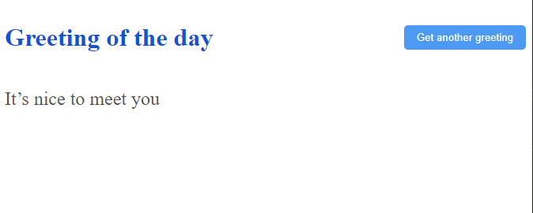

# Hello React Front End

> This is a Front-End React app that displays the random greeting fetched from Rails API. 

# Screenshot

# Built With

- React
- Redux

# Getting started

### Setup
- Clone or download this repo on your machine
- Enter project directory
- Run `npm install`
### Usage
- Run `npm start`

# Author
👤 Tolibjon Tolibov
- GitHub: [@toliboff](https://https://github.com/toliboff)
- Twitter: [@tolib_tolibov](https://twitter.com/tolib_tolibov)
- LinkedIn: [Tolibjon](https://linkedin.com/in/tolibjon-tolibov)

# Contributing
Contributions, issues, and feature requests are welcome!

Feel free to check the [issues page.](https://github.com/toliboff/hello-react-fron-end/issues)

# Show your support
Give a :star: if you like this project!

* [Microverse](https://microverse.org)

